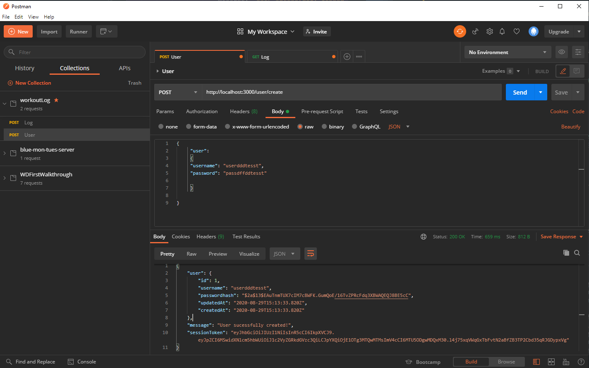
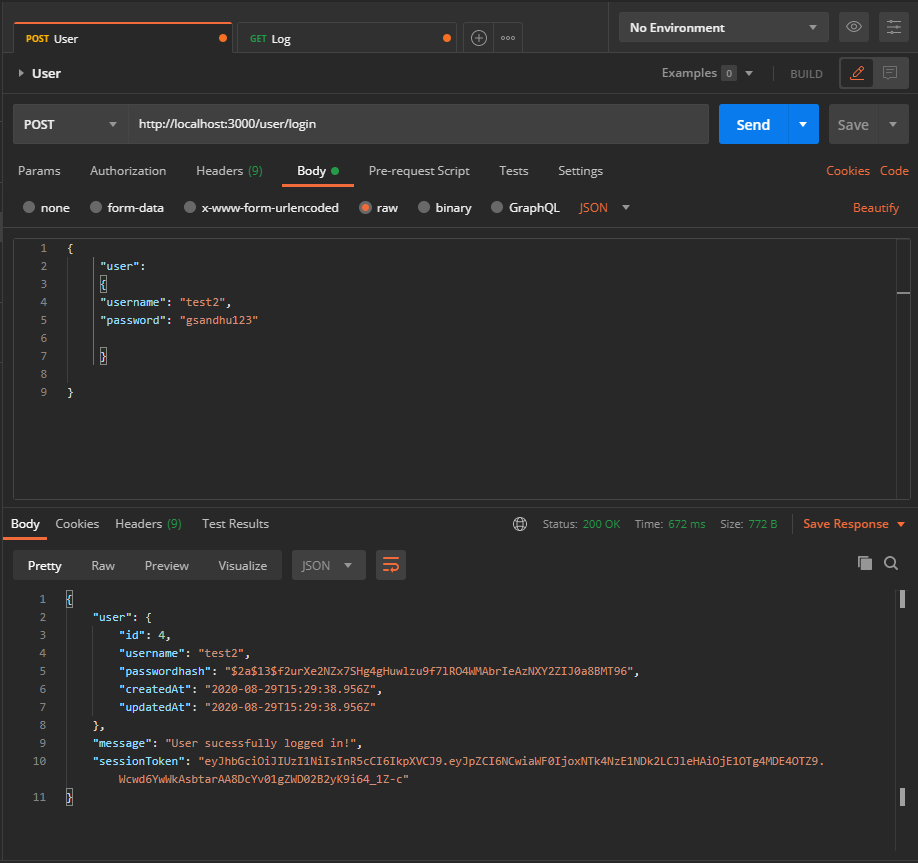
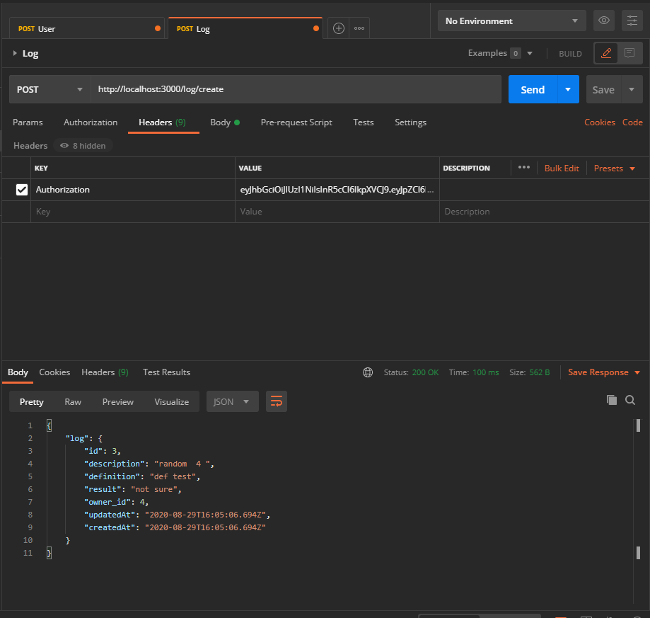
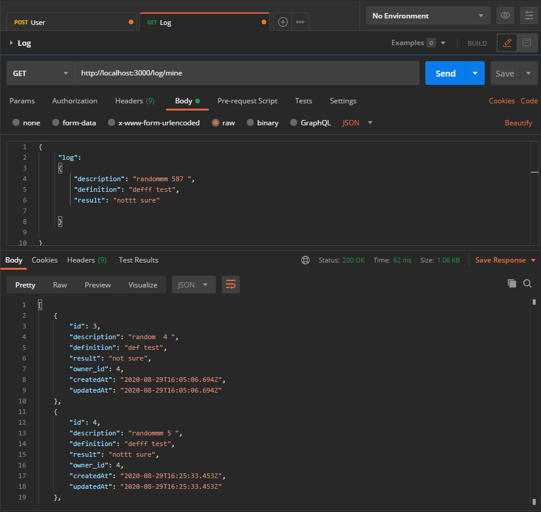
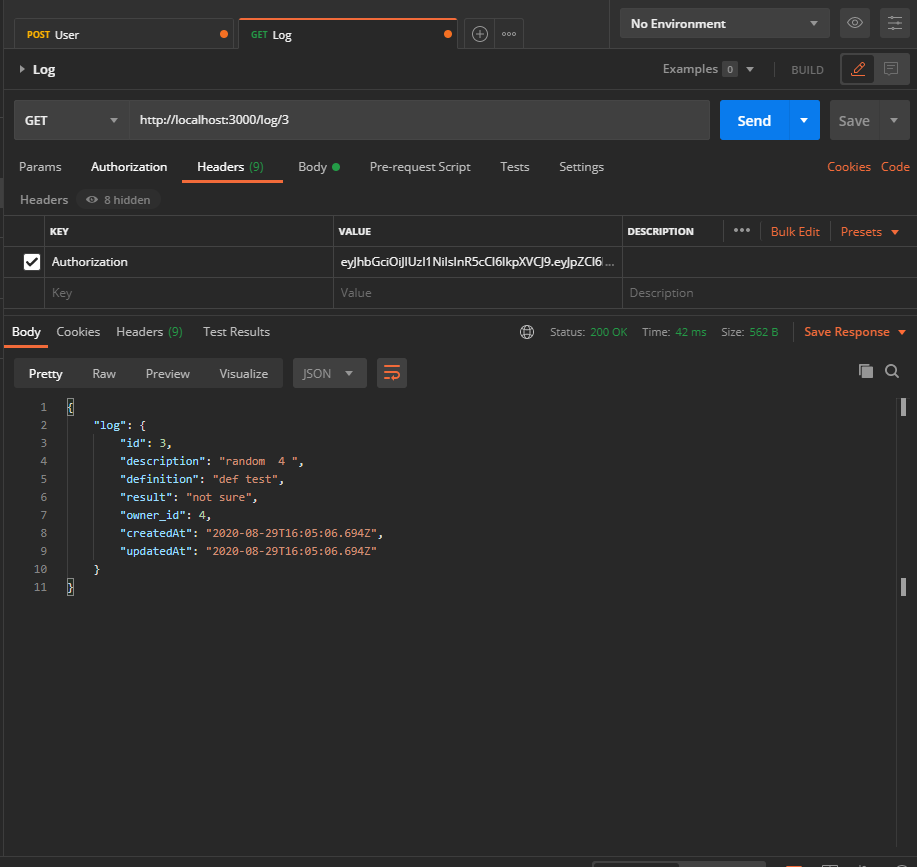
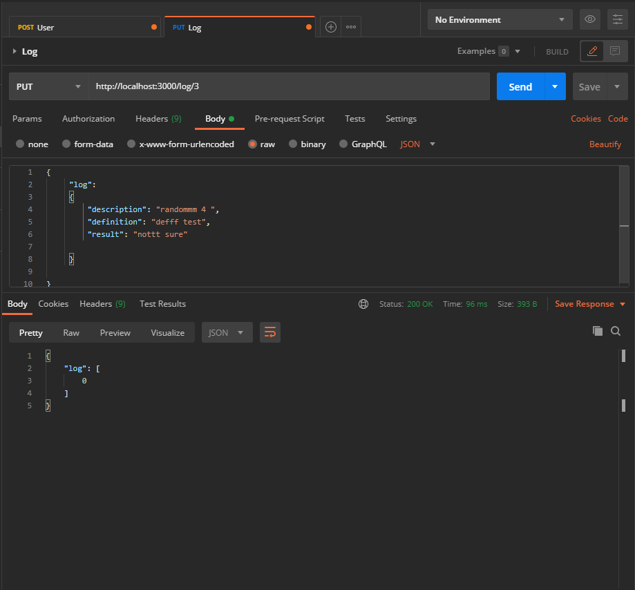
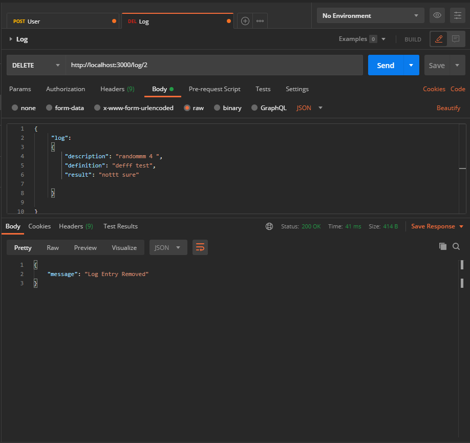
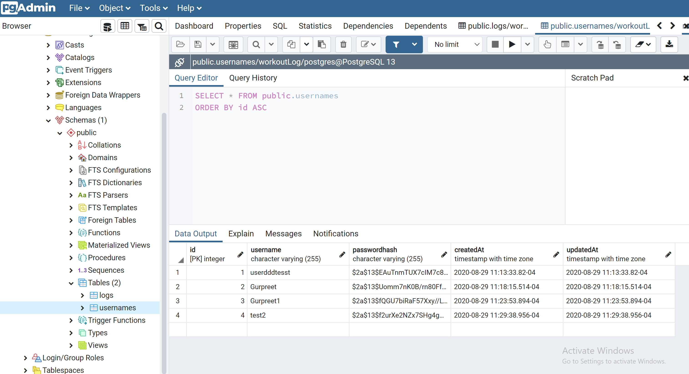

# WorkoutLogProjectWD

## Below images showcases image endpoints and routes.

#### 1. /user/create - 	Allows a new user to be created with a username and password.

#### 2. /user/login - Allows log in with an existing user.

#### 3. /log/ - Allows users to create a workout log with descriptions, definitions, results, and owner properties.

#### 4. /log/ - Gets all logs for an individual user.

#### 5. /log/:id - Gets individual logs by id for an individual user.

#### 6. /log/:id - Allows individual logs to be updated by a user.

#### 7. /log/:id - Allows individual logs to be deleted by a user.

#### 8. User Database Table

#### 9. Log Database Table

